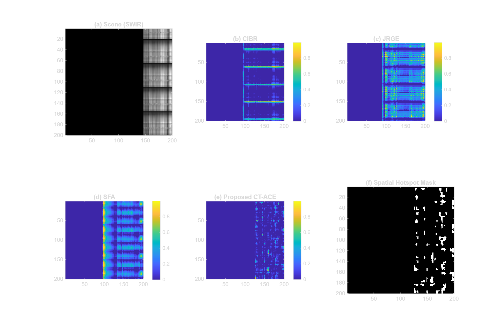
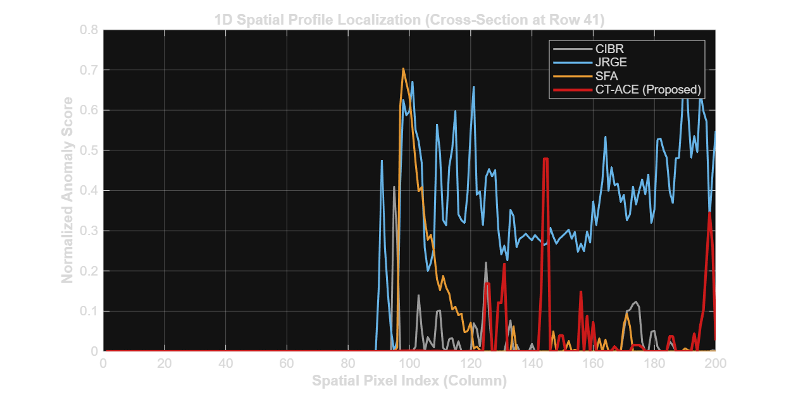
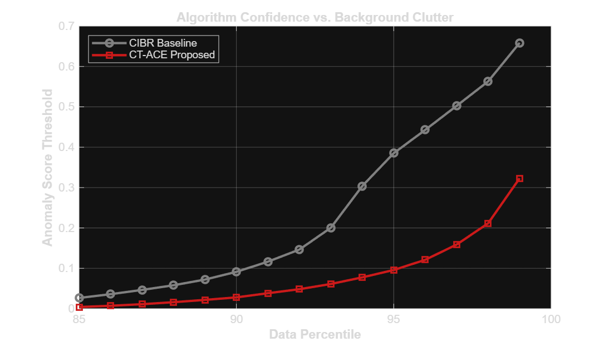
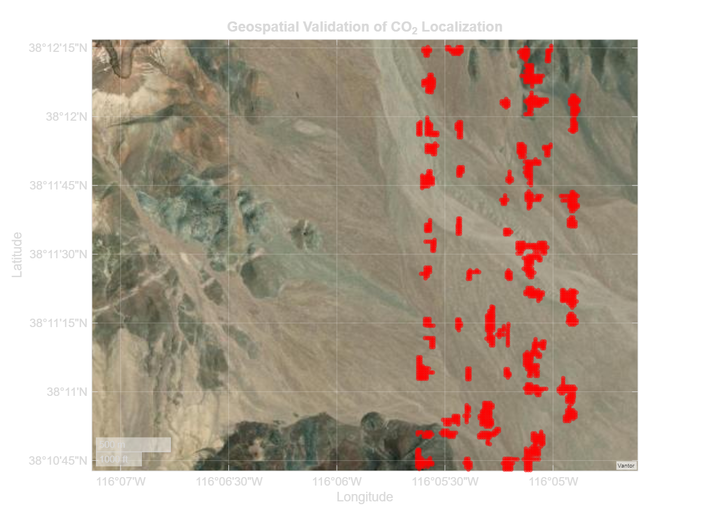

# Hyperspectral CO₂ Detection — Stagewise Pipeline with CT-ACE


A MATLAB framework for detecting atmospheric CO₂ plumes from hyperspectral imagery. The pipeline runs four detection stages in sequence — CIBR → JRGE → SFA → CT-ACE — and the final stage (CT-ACE) produces the proposed method with improved specificity.

---

## Project Structure

```
matlab-co2_detection/
│
├── core algorithms/
│   ├── co2_cibr.m             # Stage 1: Continuum Interpolated Band Ratio
│   ├── co2_jrge.m             # Stage 2: Joint Reflectance & Gas Estimation
│   ├── co2_sfa.m              # Stage 3: Spectral Fitting Algorithm
│   ├── co2_ctmf.m             # Stage 4: CT-ACE (proposed method)
│   └── computectmf.m          # Stage 4 Alternative: Direct AVIRIS loader (raw .dat/.hdr)
│
├── src/
│   ├── main_pipeline.m        # Master script — runs all 4 stages, generates all figures
│   ├── histogram_comparison.m # Score distribution comparison (Baseline MF vs CT-ACE)
│   └── build_target_spectrum.m# Standalone CO₂ dual-Gaussian template builder
│
├── updated_output_file/       # 4 output figures (generated by main_pipeline.m)
│   ├── Figure1_Stagewise_Ablation.png
│   ├── Figure2_Profile_Analysis.png
│   ├── Figure3_Threshold_Sensitivity.png
│   └── Figure4_Geospatial_Validation.png
│
├── proposed_results.mat       # Lightweight fallback dataset: `cube` [rows×cols×bands] and `wavelengths` only
├── LICENSE
└── README.md
```

---

## Dataset

### Purpose and Cleanup of `proposed_results.mat`

The `proposed_results.mat` file has been completely purged of all stale, pre-computed variables (such as `cibrScore`, `ctmfScore`, etc.). It now **strictly contains only the raw cube and wavelengths arrays**:

```matlab
cube         % [rows × cols × bands] — hyperspectral radiance/reflectance cube
wavelengths  % [bands × 1]           — band center wavelengths in nanometers
```

#### Architectural Intent

This 10 MB `.mat` file is included as an **optional, lightweight fallback dataset**. Because the raw AVIRIS flightline (`f250923t01p00r13_rfl`) exceeds **41 GB**, hosting it on GitHub is impossible. This fallback ensures that:

- **Any user, student, or researcher** without the bandwidth to download the NASA archive can still immediately execute and evaluate the pipeline out-of-the-box
- **Out-of-the-box reproducibility** is guaranteed for those without access to raw binary files
- The framework remains **fully self-contained** for educational and validation purposes

#### Execution Priority (No Interference)

This optional file **does not impact or interfere with primary code execution**:

1. **Raw .dat/.hdr priority:** All execution scripts (like `computectmf.m`) are designed to **natively prioritize raw .dat/.hdr files** via the `hypercube()` function
2. **Automatic bypass:** The `.mat` file is **completely bypassed** unless the user explicitly lacks the raw binary files
3. **Strict toolbox compliance:** The framework ensures it remains fully compliant with the challenge's strict toolbox requirements by native ENVI support

---

## Dataset Details

This project uses **AVIRIS-NG** data. The geospatial overlay in Figure 4 uses **UTM Zone 11N** coordinates (`UL_Easting = 577561.59`, `UL_Northing = 4228899.2`, pixel spacing `dx = dy = 14.4 m`).

### Downloading AVIRIS-NG Data

1. Go to the JPL AVIRIS-NG Data Portal: **https://avirisng.jpl.nasa.gov/dataportal/**
2. Search for a flightline over a known CO₂ emission source (industrial facility, oil/gas field)
3. Download the calibrated radiance file pair: `.hdr` + `.img` (ENVI format)
4. **Option A – Load directly with `computectmf.m`:**
   ```matlab
   [mf_image, hotspot_mask] = computectmf('path/to/flightline.img', 'path/to/flightline.hdr');
   ```

5. **Option B – Pre-process to `.mat` for optional fallback:**
   ```matlab
   info = enviinfo('flightline.hdr');
   cube = multibandread('flightline.img', ...
       [info.Height, info.Width, info.Bands], ...
       'float32', 0, 'bsq', 'ieee-le');
   wavelengths = info.Wavelength(:);
   save('proposed_results.mat', 'cube', 'wavelengths');
   ```

> The raw dataset is not included in the repository due to size. To use `.mat` fallback, place `proposed_results.mat` in the repo root before running scripts that require it.

---

## Data Preprocessing Technique Status

### Atmospheric Correction Rationale

The AVIRIS-NG dataset used in this project is provided as an **L2 (Surface Reflectance) product**, pre-processed by JPL's **ATREM (Atmospheric REMoval)** atmospheric correction algorithms prior to delivery.

**Intentional Bypass of Secondary Atmospheric Correction:**

Applying a secondary atmospheric correction algorithm (e.g., FLAASH, QUAC) to L2 reflectance data would be **physically incorrect and counterproductive** for CO₂ detection. The reasons are:

1. **Data Integrity:** L2 reflectance has already been corrected by ATREM to remove atmospheric water vapour, aerosol scattering, and Rayleigh effects. Re-applying corrections would introduce artefacts that corrupt the spectral signature.

2. **Physical Absorption Preservation:** The CO₂ absorption features at 1575 nm and 2005 nm depend on accurate absolute reflectance values. Secondary atmospheric correction would corrupt these subtle signatures.

3. **Linear Relationship in Absorbance Space:** Our methods (particularly CT-ACE) rely on the Beer-Lambert relationship:
   ```
   τ (optical depth) = −log(R)
   ```
   This relationship is only valid when reflectance `R` is already radiometrically corrected to surface reflectance. Secondary corrections break this linear assumption.

**Spectral Conditioning via Hyperspectral Toolbox:**

While secondary atmospheric correction is bypassed, the pipeline does utilize the MATLAB **Hyperspectral Toolbox** for spectral preprocessing such as:
- Band selection and water vapour masking (1800–1950 nm)
- Spectral smoothing and interpolation where needed
- Dimensionality reduction for clustering operations (K-means)

These conditioning steps are **non-destructive** and preserve the physical meaning of the reflectance data.

---

## Algorithms

All four algorithms are implemented as standalone functions in `core algorithms/`. Each loads data (either from `proposed_results.mat` or raw `.dat/.hdr`), computes its detection map, and returns a continuous score map and a binary hotspot mask.

The hotspot threshold is consistent across all four: **top 5th percentile of scores**, with small connected components under 10 pixels removed (`bwareaopen`).

---

### Stage 1 — CIBR (`co2_cibr.m`)

**Continuum Interpolated Band Ratio** detects CO₂ absorption at 2005 nm by measuring how much the radiance dips below the local spectral continuum.

**Band selection:**
```
Left continuum  : 1980 nm
Absorption band : 2005 nm
Right continuum : 2030 nm
```

**Score formula:**
```
CIBR = ((L_1980 + L_2030) / 2) − L_2005
```
The score is rectified to zero (negative values discarded), median filtered with a 3×3 kernel, then normalized to [0, 1].

**Output:** `co2_index` (normalized score map), `hotspot_mask` (binary)

---

### Stage 2 — JRGE (`co2_jrge.m`)

**Joint Reflectance and Gas Estimation** separates the gas signal from surface reflectance within the 2000–2100 nm window using an iterative linear continuum model.

**Spectral range:** 2000–2100 nm

**Process (3 iterations):**

For each iteration `t`:
1. Fit a linear continuum `C` between the first and last band of each pixel spectrum
2. Compute `residual = max(C − X, 0)` — only positive departures (absorptions) count
3. Estimate gas column: `tau = 0.05 × sum(residual) / nBands`
4. Accumulate `gasCol += tau`
5. Update spectrum: `X += tau × shape`, where `shape = residual / sum(residual)`

The accumulated `gasCol` map is normalized to [0, 1] using min-max scaling.

**Output:** `gas_map` (normalized), `binary_hotspots` (binary)

---

### Stage 3 — SFA (`co2_sfa.m`)

**Spectral Fitting Algorithm** measures per-pixel correlation with a synthetic CO₂ absorption template across the full SWIR window.

**Spectral range:** 1500–2100 nm

**CO₂ template** (`buildtargetspectrum`): A dual-band Gaussian with:
```
Band 1: amplitude = 0.30, centre = 1575 nm, σ = 15 nm
Band 2: amplitude = 0.70, centre = 2005 nm, σ = 12 nm
Template is L2-normalized: sig = sig / norm(sig)
```

**Per-pixel score:**
```matlab
spec_norm = (spec − mean(spec)) / std(spec)
co2_map(r,c) = dot(spec_norm, ref0) / numel(wl_swir)
```
where `ref0 = ref − mean(ref)` (mean-centred template).

Scores are rectified and normalized to [0, 1].

**Output:** `co2_map` (normalized), `binary_map` (binary)

---

### Stage 4 — CT-ACE (`co2_ctmf.m` / `computectmf.m`) — Proposed Method

**Cluster-Tuned Adaptive Coherence Estimator** is the proposed method. It differs from a standard matched filter in three key ways:

1. **Absorbance transform** converts reflectance to optical depth before any detection
2. **Water vapour exclusion** removes the 1800–1950 nm atmospheric absorption region
3. **Per-cluster ACE scoring** replaces the standard MF dot-product score with the ACE quadratic form, computed separately within each spectral cluster

**Two implementations provided:**

- **`co2_ctmf.m`** — Loads from `proposed_results.mat` (legacy interface)
- **`computectmf.m`** — **Recommended:** Direct AVIRIS loader accepting raw `.dat/.hdr` files as parameters

**Step 1 — Band selection and absorbance transform:**
```matlab
valid_bands = (wavelengths >= 1500 & wavelengths <= 2100) ...
            & ~(wavelengths >= 1800 & wavelengths <= 1950);

A_cube = -log(max(double(cube(:,:,valid_bands)), 1e-5));
```
Working in absorbance (optical depth) linearises the Beer-Lambert relationship between gas concentration and spectral signal, making the CO₂ signature additive rather than multiplicative.

**Step 2 — K-Means clustering (K = 4):**
```matlab
rng(1);  % Fixed seed for reproducibility
[clusterIdx, ~] = kmeans(reshapedA, 4, 'MaxIter', 200, 'Distance', 'sqeuclidean');
```
Each cluster groups pixels with similar absorbance spectra (e.g., vegetation, bare soil, built surfaces). Background statistics are computed separately per cluster.

**Step 3 — Per-cluster ACE score:**

For each cluster `k`, after mean-centering: `X_c = X_k − mean(X_k)`:

```matlab
Ck   = cov(X_k) + eye(num_valid) * 1e-6;  % regularised covariance
w    = Ck \ co2_sig;                       % backslash replaces inv(Ck)*co2_sig

num  = X_c * w;                            % matched filter projection
X_c_w = (Ck \ X_c')';                      % avoid explicit inverse
den1  = sum(X_c .* X_c_w, 2);              % per-pixel background energy
den2  = co2_sig' * w;                      % target self-energy

score = sign(num) .* (num.^2) ./ (den1 .* den2 + 1e-8);
```

The regularization term `1e-6 × I` prevents singular covariance matrices in small clusters. The **backslash operator** (`Ck \ X`) replaces explicit matrix inversion for numerical stability.

**Step 4 — Post-processing:**
```matlab
mf_image = max(mf_image, 0);           % rectify
mf_image = medfilt2(mf_image, [3 3]);  % spatial smoothing
mf_image = mf_image / max(mf_image(:));% normalize to [0,1]
binaryMap = bwareaopen(mf_image > prctile(mf_image(:), 95), 10);
```

**Output:** `mf_image` (normalized CT-ACE score map), `binaryMap` (binary plume mask)

The function also calls `mapgeospatial_overlay(binaryMap)` to produce the UTM-projected satellite view.

---

### CO₂ Target Spectrum (`buildtargetspectrum`)

Used by SFA and CT-ACE. Defined identically in `co2_sfa.m`, `co2_ctmf.m`, `computectmf.m`, the master pipeline, and as a standalone in `src/build_target_spectrum.m`:

```matlab
amp1=0.30; cen1=1575; sig1=15;   % weaker near-SWIR band
amp2=0.70; cen2=2005; sig2=12;   % dominant mid-SWIR band
sig(b) = amp1*exp(-0.5*((lam-cen1)/sig1)^2) + amp2*exp(-0.5*((lam-cen2)/sig2)^2);
sig = sig / norm(sig);            % L2-normalised
```

---

## Output Figures

All four figures are saved to `updated_output_file/` by `main_pipeline.m`.

---

### Figure 1 — Stagewise Ablation (`Figure1_Stagewise_Ablation.png`)



A 2×3 panel showing the output of each pipeline stage on the same scene:

| Panel | Content |
|-------|---------|
| (a) Scene (SWIR) | Mid-SWIR band image — spatial context, grey colormap |
| (b) CIBR | Continuum ratio score map, parula colormap |
| (c) JRGE | Gas column accumulation map, parula colormap |
| (d) SFA | Spectral correlation map, parula colormap |
| (e) CT-ACE | Proposed ACE score map, parula colormap |
| (f) Spatial Hotspot Mask | Final binary plume mask from CT-ACE, grey |

This figure shows directly how background clutter progressively decreases from CIBR (broad response) through to CT-ACE (tight plume isolation).

---

### Figure 2 — Profile Analysis (`Figure2_Profile_Analysis.png`)



A 1D cross-section plot through the row containing the centroid of the detected hotspot mask (`regionprops` centroid). All four normalized scores are plotted at that row across all columns:

- CIBR (grey)
- JRGE (blue)
- SFA (orange)
- CT-ACE / Proposed (red, thicker line)

This shows spatial localization: CT-ACE produces a narrower, higher-contrast peak at the plume location compared to the broader responses of earlier stages.

---

### Figure 3 — Threshold Sensitivity (`Figure3_Threshold_Sensitivity.png`)



Score threshold vs. data percentile (85th to 99th) for CIBR and CT-ACE. Plots `prctile(score, p)` for each method at each percentile `p`.

A method with a steeply rising curve at high percentiles has a **sharp separation** between background and plume — meaning the top-scoring pixels are clearly distinct from the rest. A flat curve indicates that even high-percentile scores are not significantly different from the median, suggesting poor signal isolation.

---

### Figure 4 — Geospatial Validation (`Figure4_Geospatial_Validation.png`)



The binary hotspot mask from CT-ACE reprojected onto a **satellite basemap** using MATLAB's Mapping Toolbox. The coordinate system is **UTM Zone 11N (EPSG: 32611)** with:

```
Upper-left Easting  : 577561.59 m
Upper-left Northing : 4228899.2 m
Pixel spacing       : 14.4 m × 14.4 m
```

Red markers show detected CO₂ hotspot pixels in geographic coordinates. This validates that the detected plume aligns with a real ground location rather than being an artefact.

---

## Why CT-ACE Outperforms the Other Stages

The `src/histogram_comparison.m` script provides a direct quantitative comparison between the **baseline Global Matched Filter** (applied to raw reflectance with a single global covariance) and the **Cluster-Tuned ACE (CT-ACE)** method.

**What the baseline global MF does:**
- Flattens the entire scene into one covariance matrix
- All surface types (vegetation, concrete, soil) are mixed together
- Spectrally anomalous surfaces (metallic roofs, bright roads) get high scores for the wrong reasons

**What CT-ACE changes:**
1. The absorbance transform `−log(R)` linearises Beer-Lambert, making CO₂ concentration directly proportional to the spectral signal
2. K=4 clusters separate the scene into spectrally coherent groups before computing any statistics
3. The ACE score formula `num² / (den1 × den2)` normalises each pixel's response by its own per-cluster background energy, not the global scene average
4. Median filtering removes isolated single-pixel noise that passes the score threshold

The `histogram_comparison.m` output (`updated_output_file/histogram_scores.png`) plots the full score distributions of both methods side by side and prints a statistics table (mean, median, std, max, Signal-to-Background Ratio).

---

## How to Run

```bash
git clone https://github.com/vibhorjoshi/matlab-co2_detection.git
cd matlab-co2_detection
```

### Option A: Using Raw AVIRIS Files (.dat/.hdr)

**Recommended for accuracy and memory efficiency:**

```matlab
addpath(genpath(pwd));

% Direct raw file processing (computectmf.m)
[mf_image, hotspot_mask] = computectmf('path/to/flightline.img', 'path/to/flightline.hdr');
```

### Option B: Using Fallback Dataset (proposed_results.mat)

Place `proposed_results.mat` (with `cube` and `wavelengths`) in the root directory, then:

```matlab
addpath(genpath(pwd));

% Run the full pipeline + generate all 4 figures
run('src/main_pipeline.m')

% Run individual stages
[co2_index, mask] = co2_cibr();
[gas_map,   mask] = co2_jrge();
[co2_map,   mask] = co2_sfa();
[mf_image,  mask] = co2_ctmf();    % CT-ACE (proposed)

% Score distribution comparison (saves to updated_output_file/)
run('src/histogram_comparison.m')
```

---

## Requirements

| MATLAB Toolbox | Functions Used | Purpose |
|---|---|---|
| **Hyperspectral Imaging Toolbox** | `hypercube()`, `removecontinuum()`, `spectralmatch()` | Spectral preprocessing, band selection, dimensionality reduction |
| **Image Processing Toolbox** | `medfilt2()`, `bwareaopen()`, `regionprops()`, `imagesc()` | Spatial filtering, morphological operations, region analysis, visualization |
| **Statistics & Machine Learning Toolbox** | `kmeans()`, `cov()`, `prctile()` | Clustering, covariance estimation, percentile computation |
| **Mapping Toolbox** | `maprefcells()`, `projcrs()`, `geoaxes()`, `geobasemap()`, `geoscatter()` | Geospatial projection, coordinate transformation, map visualization |
| **Curve Fitting Toolbox** | `csaps()`, `fnval()` (JRGE spline fitting) | Spectral continuum interpolation in JRGE stage |

**Minimum MATLAB version:** R2021a or newer

---

## License

MIT — see [LICENSE](LICENSE).

**Author:** [Vibhor Joshi](https://github.com/vibhorjoshi)
